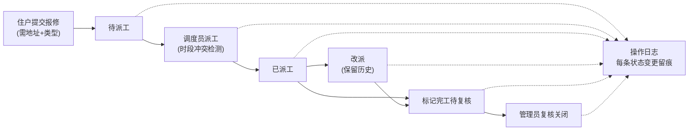

## 1. 产品概述

本地社区维修调度台，面向住宅小区物业管理场景，解决住户报修、调度员派工改派、管理员配置维护的全流程管理问题。支持工单状态流转全链路留痕，本地持久化确保数据安全。

## 2. 核心功能

### 2.1 用户角色

| 角色 | 注册方式 | 核心权限 |
|------|---------|----------|
| 住户 | 账号登录 | 提交报修单、查看本人工单、不能操作他人工单 |
| 调度员 | 账号登录 | 查看所有工单、派工、改派、标记完工待复核 |
| 管理员 | 账号登录 | 全部权限 + 配置维修类型 + 配置技工班次 + 导出报表 |

### 2.2 功能模块
1. **登录页**：角色区分登录、错误提示清晰
2. **住户首页**：提交报修单、查看本人工单列表
3. **调度台**：工单列表、派工/改派操作、状态标记
4. **管理配置页**：维修类型 CRUD、技工班次 CRUD、报表导出
5. **工单详情页**：工单信息、派工历史、操作日志

### 2.3 页面详情

| 页面名称 | 模块名称 | 功能描述 |
|---------|---------|----------|
| 登录页 | 登录表单 | 账号密码输入、角色自动识别、错误信息展示 |
| 住户首页 | 报修表单 | 标题、地址、维修类型、问题描述提交，必填校验 |
| 住户首页 | 我的工单 | 列表展示本人提交的工单，支持按状态筛选 |
| 调度台 | 工单看板 | 按状态分类展示所有工单，支持搜索筛选 |
| 调度台 | 派工弹窗 | 选择技工、预约时段、填写派工原因，冲突检测 |
| 调度台 | 改派弹窗 | 重新选择技工，保留原派工记录 |
| 管理配置页 | 维修类型配置 | 增删改查维修类型（漏水、电路、管道等） |
| 管理配置页 | 技工班次配置 | 增删改查技工及其工作时段 |
| 管理配置页 | 报表导出 | 按状态、时间范围筛选导出 CSV |
| 工单详情页 | 操作日志 | 展示每次状态变化的处理人、时间、原因 |

## 3. 核心流程

### 3.1 标准报修流程
住户提交报修 → 调度员派工给空闲技工 → （如需改派）调度员改派 → 技工完成后调度员标记完工待复核 → 管理员复核关闭

### 3.2 流程图

## 4. 用户界面设计

### 4.1 设计风格
- **主色调**：深蓝 #1e3a5f 专业稳重，辅以天蓝 #3b82f6 作为操作按钮
- **状态色**：待派工 #f59e0b、进行中 #3b82f6、待复核 #8b5cf6、已关闭 #10b981
- **按钮风格**：圆角 6px，悬停阴影过渡 0.2s
- **字体**：系统字体栈，标题 16px 加粗，正文 14px，辅助文字 12px
- **布局**：顶部导航 + 侧边栏 + 主内容区，卡片式容器
- **图标**：lucide-react 线性图标

### 4.2 页面设计概述

| 页面名称 | 模块名称 | UI 元素 |
|---------|---------|---------|
| 登录页 | 登录表单 | 居中卡片、品牌 Logo、输入框带验证反馈、错误提示条 |
| 调度台 | 工单看板 | 状态标签页、表格列表、操作按钮组、搜索筛选栏 |
| 工单详情页 | 操作日志 | 时间线布局、头像、状态徽标、操作原因展示 |
| 管理配置页 | 配置表格 | 可编辑表格、新增/删除按钮、确认弹窗 |

### 4.3 响应性
- 桌面端优先设计，最小支持 1280px 宽度
- 表格支持横向滚动，移动端简化列数
- 弹窗在小屏幕上全屏展示

## 5. 验收标准

### 5.1 主流程验收
1. 新建漏水报修（地址+类型必填）→ 派给空闲技工 → 改派 → 完工待复核 → 复核关闭
2. 缺少地址或类型时不能建单，有明确错误提示
3. 住户不能关闭别人的工单（无操作按钮 + 后端校验）
4. 同一技工重叠时段不能重复派工（前端提示 + 后端校验）

### 5.2 数据持久化
1. 重启服务后，工单状态、派工历史、配置数据保持不变
2. 导出的报表数据与重启前一致

### 5.3 样例账号
- 住户：zhangsan / 123456
- 调度员：dispatcher / 123456
- 管理员：admin / 123456
