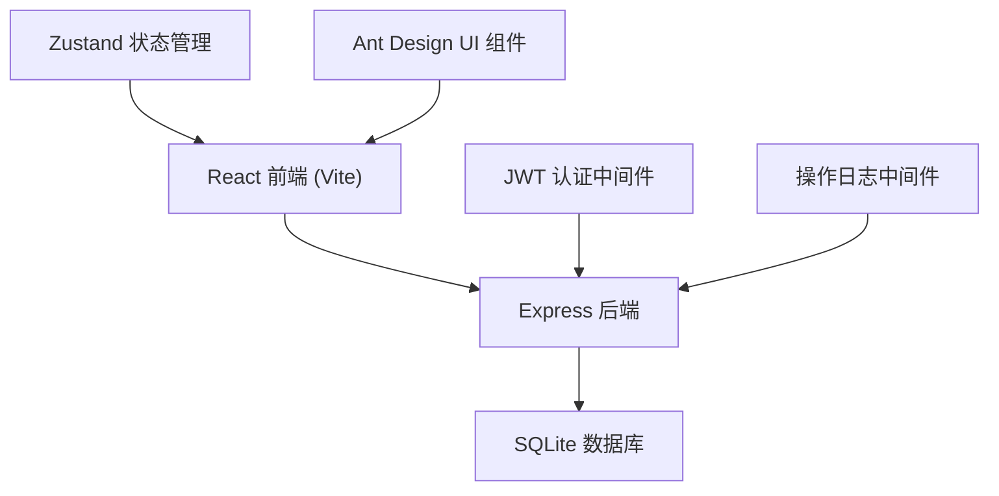
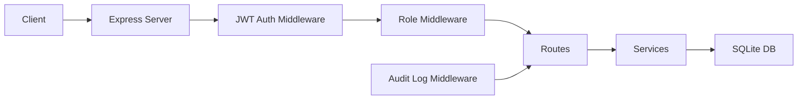
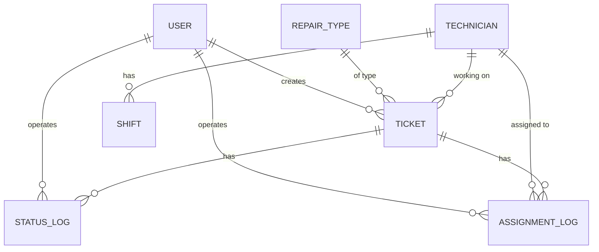

## 1. 架构设计



## 2. 技术描述

- **前端**：React@18 + TypeScript + Vite@5 + TailwindCSS@3 + AntDesign@5 + Zustand@4 + lucide-react
- **后端**：Express@4 + TypeScript + better-sqlite3 + jsonwebtoken + bcryptjs
- **数据库**：SQLite3（本地文件 `./data/app.db`，无需额外服务）
- **认证**：JWT Token，前端存储于 localStorage，后端中间件校验
- **初始化工具**：vite-init（react-express-ts 模板）

## 3. 目录结构

```
├── src/                    # 前端代码
│   ├── components/         # 公共组件
│   ├── pages/              # 页面组件
│   ├── hooks/              # 自定义 hooks
│   ├── store/              # Zustand 状态
│   ├── utils/              # 工具函数
│   ├── api/                # API 封装
│   └── types/              # 类型定义
├── api/                    # 后端代码
│   ├── src/
│   │   ├── routes/         # 路由
│   │   ├── middleware/     # 中间件
│   │   ├── services/       # 业务逻辑
│   │   ├── db/             # 数据库初始化
│   │   └── types/          # 类型定义
│   └── server.ts           # 入口
├── data/                   # SQLite 数据文件
├── shared/                 # 前后端共享类型
└── migrations/             # 数据库迁移脚本
```

## 4. 路由定义

| 前端路由 | 页面 | 权限 |
|---------|------|------|
| /login | 登录页 | 公开 |
| /resident | 住户首页（报修+我的工单） | 住户 |
| /dispatch | 调度台 | 调度员/管理员 |
| /admin | 管理配置页 | 管理员 |
| /ticket/:id | 工单详情 | 所有登录用户 |

| 后端 API | 方法 | 权限 | 说明 |
|---------|------|------|------|
| /api/auth/login | POST | 公开 | 登录获取 token |
| /api/tickets | GET | 登录用户 | 获取工单列表（按角色过滤） |
| /api/tickets | POST | 住户 | 创建工单 |
| /api/tickets/:id | GET | 登录用户 | 获取工单详情 |
| /api/tickets/:id/assign | POST | 调度员+ | 派工 |
| /api/tickets/:id/reassign | POST | 调度员+ | 改派 |
| /api/tickets/:id/complete | POST | 调度员+ | 标记完工待复核 |
| /api/tickets/:id/close | POST | 管理员 | 复核关闭 |
| /api/repair-types | GET/POST/PUT/DELETE | 管理员 | 维修类型 CRUD |
| /api/technicians | GET/POST/PUT/DELETE | 管理员 | 技工 CRUD |
| /api/shifts | GET/POST/PUT/DELETE | 管理员 | 班次 CRUD |
| /api/reports/export | GET | 管理员 | 导出报表 CSV |

## 5. API 类型定义

```typescript
// 共享类型
type UserRole = 'resident' | 'dispatcher' | 'admin';
type TicketStatus = 'pending' | 'assigned' | 'reassigned' | 'completed' | 'closed';

interface User {
  id: number;
  username: string;
  role: UserRole;
  name: string;
  phone: string;
  createdAt: string;
}

interface RepairType {
  id: number;
  name: string;
  description: string;
  createdAt: string;
}

interface Technician {
  id: number;
  name: string;
  phone: string;
  skill: string;
  createdAt: string;
}

interface Shift {
  id: number;
  technicianId: number;
  dayOfWeek: number; // 0-6
  startTime: string; // HH:mm
  endTime: string; // HH:mm
  createdAt: string;
}

interface Ticket {
  id: number;
  title: string;
  description: string;
  address: string;
  repairTypeId: number;
  residentId: number;
  status: TicketStatus;
  currentTechnicianId: number | null;
  scheduledStartTime: string | null;
  scheduledEndTime: string | null;
  createdAt: string;
  updatedAt: string;
}

interface AssignmentLog {
  id: number;
  ticketId: number;
  fromTechnicianId: number | null;
  toTechnicianId: number;
  scheduledStartTime: string;
  scheduledEndTime: string;
  reason: string;
  operatorId: number;
  createdAt: string;
}

interface StatusLog {
  id: number;
  ticketId: number;
  fromStatus: TicketStatus;
  toStatus: TicketStatus;
  reason: string;
  operatorId: number;
  createdAt: string;
}

// 请求/响应
interface LoginRequest {
  username: string;
  password: string;
}

interface LoginResponse {
  token: string;
  user: User;
}

interface CreateTicketRequest {
  title: string;
  description: string;
  address: string;
  repairTypeId: number;
}

interface AssignTicketRequest {
  technicianId: number;
  scheduledStartTime: string;
  scheduledEndTime: string;
  reason: string;
}
```

## 6. 服务器架构



## 7. 数据模型

### 7.1 ER 图



### 7.2 DDL

```sql
-- 用户表
CREATE TABLE users (
  id INTEGER PRIMARY KEY AUTOINCREMENT,
  username VARCHAR(50) UNIQUE NOT NULL,
  password_hash VARCHAR(255) NOT NULL,
  role VARCHAR(20) NOT NULL CHECK (role IN ('resident', 'dispatcher', 'admin')),
  name VARCHAR(100) NOT NULL,
  phone VARCHAR(20),
  created_at DATETIME DEFAULT CURRENT_TIMESTAMP
);

-- 维修类型表
CREATE TABLE repair_types (
  id INTEGER PRIMARY KEY AUTOINCREMENT,
  name VARCHAR(50) UNIQUE NOT NULL,
  description TEXT,
  created_at DATETIME DEFAULT CURRENT_TIMESTAMP
);

-- 技工表
CREATE TABLE technicians (
  id INTEGER PRIMARY KEY AUTOINCREMENT,
  name VARCHAR(100) NOT NULL,
  phone VARCHAR(20) NOT NULL,
  skill VARCHAR(100),
  created_at DATETIME DEFAULT CURRENT_TIMESTAMP
);

-- 班次表
CREATE TABLE shifts (
  id INTEGER PRIMARY KEY AUTOINCREMENT,
  technician_id INTEGER NOT NULL,
  day_of_week INTEGER NOT NULL CHECK (day_of_week BETWEEN 0 AND 6),
  start_time TIME NOT NULL,
  end_time TIME NOT NULL,
  created_at DATETIME DEFAULT CURRENT_TIMESTAMP,
  FOREIGN KEY (technician_id) REFERENCES technicians(id)
);

-- 工单表
CREATE TABLE tickets (
  id INTEGER PRIMARY KEY AUTOINCREMENT,
  title VARCHAR(200) NOT NULL,
  description TEXT,
  address VARCHAR(500) NOT NULL,
  repair_type_id INTEGER NOT NULL,
  resident_id INTEGER NOT NULL,
  status VARCHAR(20) NOT NULL DEFAULT 'pending' CHECK (status IN ('pending', 'assigned', 'reassigned', 'completed', 'closed')),
  current_technician_id INTEGER,
  scheduled_start_time DATETIME,
  scheduled_end_time DATETIME,
  created_at DATETIME DEFAULT CURRENT_TIMESTAMP,
  updated_at DATETIME DEFAULT CURRENT_TIMESTAMP,
  FOREIGN KEY (repair_type_id) REFERENCES repair_types(id),
  FOREIGN KEY (resident_id) REFERENCES users(id),
  FOREIGN KEY (current_technician_id) REFERENCES technicians(id)
);

-- 派工历史表
CREATE TABLE assignment_logs (
  id INTEGER PRIMARY KEY AUTOINCREMENT,
  ticket_id INTEGER NOT NULL,
  from_technician_id INTEGER,
  to_technician_id INTEGER NOT NULL,
  scheduled_start_time DATETIME NOT NULL,
  scheduled_end_time DATETIME NOT NULL,
  reason TEXT NOT NULL,
  operator_id INTEGER NOT NULL,
  created_at DATETIME DEFAULT CURRENT_TIMESTAMP,
  FOREIGN KEY (ticket_id) REFERENCES tickets(id),
  FOREIGN KEY (from_technician_id) REFERENCES technicians(id),
  FOREIGN KEY (to_technician_id) REFERENCES technicians(id),
  FOREIGN KEY (operator_id) REFERENCES users(id)
);

-- 状态变更日志表
CREATE TABLE status_logs (
  id INTEGER PRIMARY KEY AUTOINCREMENT,
  ticket_id INTEGER NOT NULL,
  from_status VARCHAR(20) NOT NULL,
  to_status VARCHAR(20) NOT NULL,
  reason TEXT NOT NULL,
  operator_id INTEGER NOT NULL,
  created_at DATETIME DEFAULT CURRENT_TIMESTAMP,
  FOREIGN KEY (ticket_id) REFERENCES tickets(id),
  FOREIGN KEY (operator_id) REFERENCES users(id)
);

-- 索引
CREATE INDEX idx_tickets_status ON tickets(status);
CREATE INDEX idx_tickets_resident ON tickets(resident_id);
CREATE INDEX idx_tickets_technician ON tickets(current_technician_id);
CREATE INDEX idx_status_logs_ticket ON status_logs(ticket_id);
CREATE INDEX idx_assignment_logs_ticket ON assignment_logs(ticket_id);
CREATE INDEX idx_shifts_technician ON shifts(technician_id);
```

### 7.3 初始数据

```sql
-- 初始用户（密码均为 123456，bcrypt 哈希）
INSERT INTO users (username, password_hash, role, name, phone) VALUES
('admin', '$2a$10$...', 'admin', '系统管理员', '13800000000'),
('dispatcher', '$2a$10$...', 'dispatcher', '张调度', '13800000001'),
('zhangsan', '$2a$10$...', 'resident', '张三', '13800000002'),
('lisi', '$2a$10$...', 'resident', '李四', '13800000003');

-- 初始维修类型
INSERT INTO repair_types (name, description) VALUES
('漏水维修', '水管、水龙头、热水器等漏水问题'),
('电路维修', '开关、插座、灯具等电路问题'),
('管道疏通', '马桶、下水道堵塞问题'),
('门窗维修', '门窗、锁具损坏问题'),
('家电维修', '空调、冰箱等家电故障');

-- 初始技工
INSERT INTO technicians (name, phone, skill) VALUES
('王师傅', '13900000001', '水电维修'),
('李师傅', '13900000002', '管道疏通'),
('张师傅', '13900000003', '综合维修');

-- 初始班次（周一至周五 9:00-18:00）
INSERT INTO shifts (technician_id, day_of_week, start_time, end_time) VALUES
(1, 1, '09:00', '18:00'), (1, 2, '09:00', '18:00'), (1, 3, '09:00', '18:00'),
(1, 4, '09:00', '18:00'), (1, 5, '09:00', '18:00'),
(2, 1, '09:00', '18:00'), (2, 2, '09:00', '18:00'), (2, 3, '09:00', '18:00'),
(2, 4, '09:00', '18:00'), (2, 5, '09:00', '18:00'),
(3, 1, '09:00', '18:00'), (3, 2, '09:00', '18:00'), (3, 3, '09:00', '18:00'),
(3, 4, '09:00', '18:00'), (3, 5, '09:00', '18:00');

-- 初始工单
INSERT INTO tickets (title, description, address, repair_type_id, resident_id, status) VALUES
('卫生间水龙头漏水', '主卫生间洗手盆水龙头滴水，已持续3天', '1栋1单元101室', 1, 3, 'pending'),
('客厅灯不亮', '客厅吸顶灯开关后不亮，可能是镇流器坏了', '2栋3单元502室', 2, 4, 'assigned');
```

## 8. 核心业务规则

1. **必填校验**：创建工单必须填写 `address` 和 `repairTypeId`，后端返回 400 + 明确错误信息
2. **权限控制**：
   - 住户只能查看自己的工单，不能操作状态变更
   - 调度员不能关闭工单（仅管理员可复核关闭）
   - 所有写操作需校验角色权限
3. **时间冲突检测**：派工时查询该技工在 `[scheduledStartTime, scheduledEndTime]` 区间内是否已有派工，如有则返回 409 冲突
4. **操作留痕**：所有状态变更、派工/改派操作都写入 `status_logs` 或 `assignment_logs`，记录操作人、时间、原因
5. **改派逻辑**：更新工单 `current_technician_id`，原派工记录保留在 `assignment_logs`，新派工记录 `from_technician_id` 为原技工 ID
